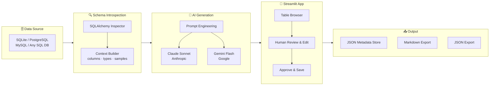

# 🤖 GenAI Metadata Manager

> Auto-generate business-friendly database documentation using
> Claude (Anthropic) and Gemini (Google) — the AI-powered solution
> to the #1 most-hated data engineering task.

## 🎯 Problem Solved
Data engineers spend hours writing column descriptions nobody reads.
This tool introspects your database schema and generates rich,
business-friendly documentation in seconds using GenAI.

## ✨ Features
- Connects to any SQL database (SQLite, PostgreSQL, MySQL)
- Introspects schema: columns, types, PKs, FKs, sample data
- Generates docs with Claude Sonnet or Gemini Flash
- Human-in-the-loop: review, edit, and approve before saving
- Exports to Markdown and JSON
- Ships with a realistic healthcare RCM demo database

## 🏗️ Architecture


## 🚀 Quick Start
```bash
git clone https://github.com/yourusername/genai-metadata-manager
cd genai-metadata-manager
python -m venv .venv && source .venv/bin/activate
pip install -r requirements.txt
cp .env.example .env  # Add your API keys
streamlit run app.py
```

## 🔑 API Keys Required
- **Anthropic API key**: console.anthropic.com (free tier available)
- **Google API key**: aistudio.google.com (free tier: 15 RPM)

## 🛠️ Tech Stack
Python · Streamlit · SQLAlchemy · Anthropic SDK · Google Generative AI

## 📄 License
MIT